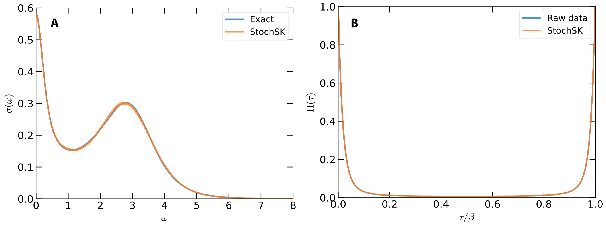

!!! info

    In order to demonstrate usefulness of the ACFlow toolkit, four examples are illustrated in this section. These examples cover typical application scenarios of the ACFlow toolkit, including analytic continuations of

    * Matsubara self-energy function
    * Matsubara Green's function
    * Imaginary time Green's function
    * Current-current correlation function

    within the script mode or standard mode. All of the necessary source codes and data files, which can be used to reproduce the results as shown in this section, are placed in the `/home/your_home/acflow/tutor/T*` folders.

The former three examples only concern fermionic correlators. How about bosonic correlators? In this example, we will demonstrate how to perform analytic continuation simulation for a typical bosonic correlator, the current-current correlation function ``\Pi(\tau)``, to obtain the optical conductivity ``\sigma(\omega)``. Note that this example is taken from *Phys. Rev. B 82, 165125 (2010)* directly.

## Model

The exact optical conductivity ``\sigma(\omega)`` reads:
```math
\sigma(\omega) =
\left\{
\frac{W_1}{1 + (\omega/\Gamma_1)^2} +
\frac{W_2}{1 + [(\omega - \epsilon)/\Gamma_2]^2} +
\frac{W_2}{1 + [(\omega + \epsilon)/\Gamma_2]^2}
\right\}
\frac{1}{1 + (\omega/\Gamma_3)^6},
```
where ``W_1 = 0.3``, ``W_2 = 0.2``, ``\Gamma_1 = 0.3``, ``\Gamma_2 = 1.2``, ``\Gamma_3 = 4.0``, and ``\epsilon = 3.0``. The current-current correlation function ``\Pi(\tau)`` can be evaluated from ``\sigma(\omega)`` by using the following equation:
```math
\Pi(\tau) = \int^{\infty}_{-\infty} K(\tau,\omega) \sigma(\omega)~d\omega,
```
where the kernel function ``K(\tau,\omega)`` is different from the general form. It reads:
```math
K(\tau,\omega) = \frac{1}{\pi} \frac{\omega e^{-\tau\omega}}{1- e^{-\beta\omega}}.
```
In this case, ``\beta`` is fixed to be 20.0.

## Analytic Continuation

At first, we use the above equations to prepare ``\Pi(\tau)``. The error bar of ``\Pi(\tau)`` is fixed to 1e-4. The calculated ``\Pi(\tau)`` is written in `chit.data`.

Next, we conduct analytic continuation simulation as usual. The used configuration file is attached as follows. Here, the `StochSK` solver is adopted, so the `solver` parameter is ''StochSK'' and the `grid` parameter is ''btime''. And the Shao-Sandvik algorithm is applied to seek optimal ``\Theta``, so the `method` parameter is ''chi2min''. The users can further increase the values of `nfine`, `ngamm`, and `nstep` parameters to improve computational accuracy.

```toml
[BASE]
finput = "chit.data"
solver = "StochSK"
ktype  = "bsymm"
mtype  = "flat"
grid   = "btime"
mesh   = "linear"
ngrid  = 501
nmesh  = 801
wmax   = 8.0
wmin   = 0.0
beta   = 20.0
offdiag = false

[StochSK]
method = "chi2min"
nfine = 40000
ngamm = 1000
nwarm = 1000
nstep = 20000
ndump = 200
retry = 10
theta = 1e+6
ratio = 0.90
```

The calculated results are illustrated in **Fig.1**. From **Fig.1(a)**, it is clear that the main features of optical conductivity are successfully captured by the `StochSK` solver. Both the sharp Drude peak at ``\omega = 0`` and a broad satellite peak around ``\omega = 3.0`` are well reproduced. As is seen in **Fig.1(b)**, the reconstructed ``\tilde{\Pi}(\tau)`` coincides with the original ``\Pi(\tau)``.



**Figure 1 |** Analytic continuation of current-current correlation function by using the stochastic analytic continuation (Sandvik's algorithm). (a) Simulated and exact optical conductivities ``\sigma(\omega)``. (b) Simulated and exact current-current correlation functions ``\Pi(\tau)``.
