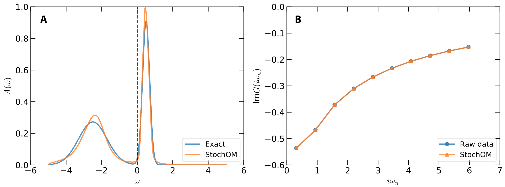

!!! info

    In order to demonstrate usefulness of the ACFlow toolkit, four examples are illustrated in this section. These examples cover typical application scenarios of the ACFlow toolkit, including analytic continuations of

    * Matsubara self-energy function
    * Matsubara Green's function
    * Imaginary time Green's function
    * Current-current correlation function

    within the script mode or standard mode. All of the necessary source codes and data files, which can be used to reproduce the results as shown in this section, are placed in the `/home/your_home/acflow/tutor/T*` folders.

The purpose of the second example is to treat the Matsubara Green's function by using the `StochOM` solver.

## Model

At first, please consider the following spectral density with two gaussian peaks:
```math
A(\omega) =
A_1 \exp\left[\frac{-(\omega - \epsilon_1)^2}{2 \Gamma^2_1}\right] +
A_2 \exp\left[\frac{-(\omega - \epsilon_2)^2}{2 \Gamma^2_2}\right],
```
with ``A_1 = 1.0``, ``A_2 = 0.3``, ``\epsilon_1 = 0.5``, ``\epsilon_2 = -2.5``, ``\Gamma_1 = 0.2``, and ``\Gamma_2 = 0.8``. Then the Matsubara Green's function ``G(i\omega_n)`` is evaluated by using ``\mathbf{G} = \mathbf{KA}`` with ``\beta = 10.0``. Random noises, built by formula ``0.0001 r_1 \exp{}(i 2\pi r_2 )`` where ``r_1`` and ``r_2`` are random numbers in (0.0,1.0), are added to ``G(i\omega_n)``. The error bar of ``G(i\omega_n)`` is fixed to 1e-4. The generated data for ``G(i\omega_n)`` are written in `giw.data`.

## Analytic Continuation

Next, we are going to use the standard mode, such that a configure file (`ac.toml`) must be prepared. It is listed as follows. Since the `StochOM` solver is chosen, the `[BASE]` and `[StochOM]` blocks must be present at the same time.

```toml
[BASE]
finput = "giw.data"
solver = "StochOM"
ktype  = "fermi"
mtype  = "flat"
grid   = "ffreq"
mesh   = "linear"
ngrid  = 10
nmesh  = 501
wmax   = 5.0
wmin   = -5.0
beta   = 10.0
offdiag = false

[StochOM]
ntry  = 100000
nstep = 1000
nbox  = 100
sbox  = 0.005
wbox  = 0.02
norm  = -1.0
```

Then we use the `acrun.jl` or `acprun.jl` script to perform analytic continuation simulation. The calculated results are shown in **Figure 1**. As is seen in **Figure 1(a)**, both the sharp peak around 0.5 eV and the broad peak around -2.5 eV are correctly reproduced by the `StochOM` solver. In **Figure 1(b)**, the reconstructed Matsubara Green's function agrees quite well with the raw input data.



**Figure 1 |** Analytic continuation of Matsubara Green's function by using the stochastic optimization method. (a) Simulated and exact spectral functions. (b) Reconstructed and synthetic Matsubara Green's functions. Only the imaginary parts are presented in this figure.
