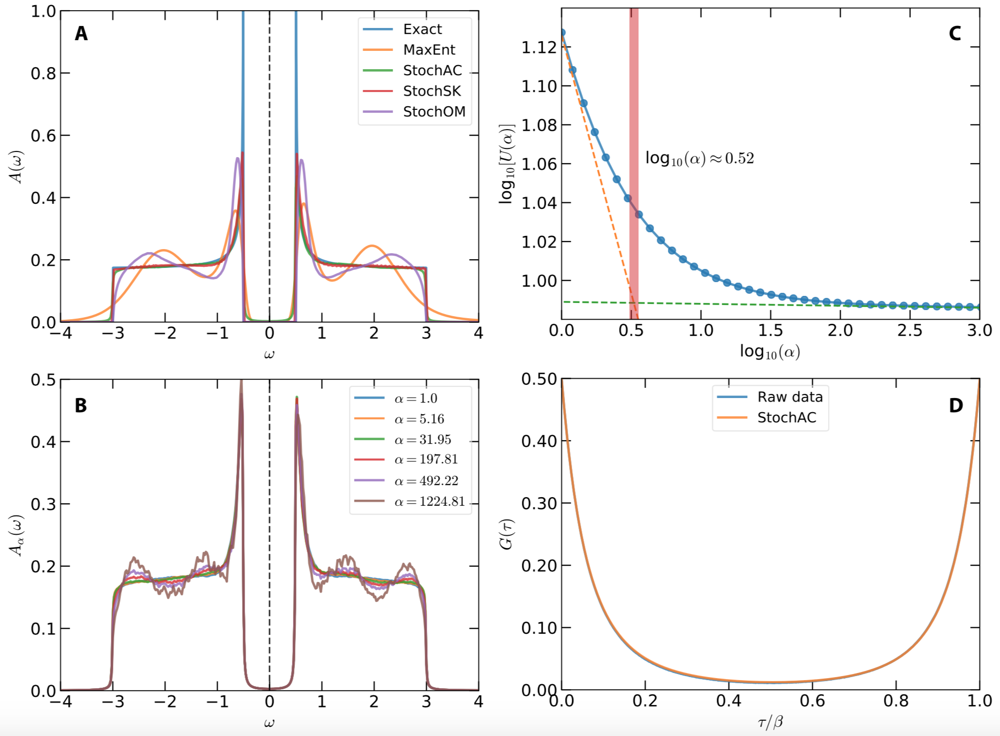

!!! info

    In order to demonstrate usefulness of the ACFlow toolkit, four examples are illustrated in this section. These examples cover typical application scenarios of the ACFlow toolkit, including analytic continuations of

    * Matsubara self-energy function
    * Matsubara Green's function
    * Imaginary time Green's function
    * Current-current correlation function

    within the script mode or standard mode. All of the necessary source codes and data files, which can be used to reproduce the results as shown in this section, are placed in the `/home/your_home/acflow/tutor/T*` folders.

In this example, analytic continuation of imaginary time Green's function will be tested. Note that this example is borrowed from *	arXiv:cond-mat/0403055* directly.

## Model

The exact spectral function reads:
```math
A(\omega) =
\begin{cases}
\frac{1}{W} \frac{|\omega|}{\sqrt{\omega^2 - \Delta^2}},~\quad & \text{if}~\Delta < |\omega| < W/2. \\
0, & \text{otherwise}.
\end{cases}
```
Here, ``W`` denotes bandwidth, and ``\Delta`` is used to control size of the energy gap. Let ``W = 6`` and ``2\Delta = 1``. This spectrum should exhibit flat shoulders, steep peaks, and sharp gap edges. Actually, it is the spectrum of a BCS superconductor.

## Analytic Continuation

First, the imaginary time Green's function ``G(\tau)`` is generated using ``\mathbf{G} = \mathbf{KA}``. Then a normally-distributed random noise is add to ``G(\tau)``. Maximum amplitude of the noise is 1e-4. The error bar of ``G(\tau)`` is fixed to 1e-3. The data are written in `gtau.data`.

Next, we try to prepare the configure file (`ac.toml`). In this case, we would like to benchmark the `StochAC` solver, so the `solver` parameter is set to ''StochAC'' and the `grid` parameter is set to ''ftime''. Furthermore, the `exclude` parameter is enabled to impose some *a priori* constraints to the spectrum. The full `ac.toml` is listed as follows:

```toml
[BASE]
finput = "giw.data"
solver = "MaxEnt"
ktype  = "fermi"
mtype  = "flat"
grid   = "ffreq"
mesh   = "linear"
ngrid  = 10
nmesh  = 501
wmax   = 5.0
wmin   = -5.0
beta   = 10.0
offdiag = false
exclude = [[-5.0,-3.0], [-0.5,0.5], [3.0,5.0]]

[StochAC]
nfine = 10000
ngamm = 512
nwarm = 4000
nstep = 10000000
ndump = 40000
nalph = 40
alpha = 1.00
ratio = 1.20
```

We perform analytic continuation simulation by running the `acrun.jl` or `acprun.jl` script. In order to obtain smooth spectral density, it is useful to increase number of ``\delta`` functions (See `ngamm` parameter) and number of Monte Carlo sampling steps (See `nstep` parameter).

**Figure 1** shows the calculated results. In **Figure 1(a)**, the exact spectral function is compared with the simulated spectrum. Note that besides the `StochAC` solver, the other three solvers are also tested. Their results are also plotted in this figure for a direct comparison. It is remarkable that the `StochAC` and `StochSK` solvers do a superior job of modelling the spectrum. The major characteristics of the spectrum, including flat regions, steep peaks, and sharp gap edges, are well captured by the two solvers. Especially, we have finished more tests without any constraints on the spectral density. The gap in the spectrum can be reproduced as well. On the other hand, the spectra obtained by the `MaxEnt` and `StochOM` solvers are much too smooth, and show extra shoulder peaks around ``\pm`` 2.0. **Figure 1(b)** shows ``\alpha``-resolved spectral functions ``A_{\alpha}(\omega)`` for selected ``\alpha`` parameters. Fluctuation in the flat regions of the calculated spectral density grows when ``\alpha`` increases. **Figure 1(c)** shows internal energy ``U`` as a function of ``\alpha``. From this figure, the critical ``\alpha`` is estimated, which is indicated by the vertical bar. Finally, the reproduced Green's function ``\tilde{G}(\tau)`` agrees quite well with the raw input data, which is shown in **Figure 1(d)**.



**Figure 1 |** Analytic continuation of imaginary time Green's function by using the stochastic analytic continuation (Beach's algorithm). (a) Simulated and exact spectral functions. (b) ``\alpha``-dependent spectral functions. (c) Internal energy ``U`` as a function of ``\alpha``. The vertical bar indicates the optimal ``\alpha`` parameter. (d) Simulated and exact imaginary time Green's functions.
