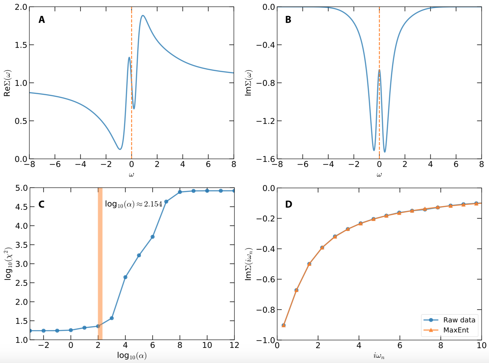

!!! info

    In order to demonstrate usefulness of the ACFlow toolkit, four examples are illustrated in this section. These examples cover typical application scenarios of the ACFlow toolkit, including analytic continuations of

    * Matsubara self-energy function
    * Matsubara Green's function
    * Imaginary time Green's function
    * Current-current correlation function

    within the script mode or standard mode. All of the necessary source codes and data files, which can be used to reproduce the results as shown in this section, are placed in the `/home/your_home/acflow/tutor/T*` folders.

## [Model](@id ex_sigma)

Now let us consider the following single-band Hubbard model on a Bethe lattice at first:
```math
H = -t \sum_{\langle ij \rangle \sigma} c^{\dagger}_{i\sigma}c_{j\sigma}
 - \mu \sum_i n_i + U \sum_i n_{i\uparrow} n_{i\downarrow},
```
where ``t`` is the hopping parameter, ``\mu`` is the chemical potential, ``U`` is the Coulomb interaction, ``n`` is the occupation number, ``\sigma`` denotes the spin, ``i`` and ``j`` are site indices. This model is solved by using the dynamical mean-field theory (dubbed DMFT) with the hybridization expansion continuous-time quantum Monte Carlo solver (dubbed CT-HYB) as implemented in the ``i``QIST package. The parameters used in the DMFT + CT-HYB calculation are ``t = 0.5``, ``U = 2.0``, ``\mu = 1.0``, and ``\beta = 10.0``. Once the DMFT self-consistent calculation is finished, the Matsubara self-energy function ``\Sigma(i\omega_n)`` is obtained. We are going to convert it to real frequency self-energy function ``\Sigma(\omega)``. The data of Matsubara self-energy function ``\Sigma(i\omega_n)`` have been preprocessed and stored in `siw.data`. This file contains five columns, which are used to record the Matsubara frequency ``\omega_n``, Re``\Sigma(i\omega_n)``, Im``\Sigma(i\omega_n)``, error bar of Re``\Sigma(i\omega_n)``, error bar of Im``\Sigma(i\omega_n)``, respectively. Only the first twenty Matsubara frequency points are kept, because the high-frequency data are somewhat noisy.

## Analytic Continuation

The purpose of this example is to demonstrate usage of the `MaxEnt` solver and the script mode of the ACFlow toolkit. Next we will explain the key steps in detail. As for the complete Julia script, please refer to `sigma.jl` and `gendata.jl` in the `/home/your_home/acflow/tutor/T01/` folder.

First, we have to load the essential Julia packages. Both the `DelimitedFiles` and `Printf` packages belong to Julia's standard library. They are used to read input data and write calculated results, respectively.

```julia
#!/usr/bin/env julia

using DelimitedFiles
using Printf
using ACFlow

welcome() # Print welcome message only
```

Next, the data of Matsubara self-energy function are read from `siw.data`. The Hartree term ``\Sigma_{H}`` should be subtracted from its real part:
```math
\Sigma(i\omega_n) \to \Sigma(i\omega_n) - \Sigma_{H}.
```
Note that ``\Sigma_{H}`` is approximately equal to the asymptotic value of real part of ``\Sigma(i\omega_n)`` when ``n`` goes to infinite.

```julia
# Deal with self-energy function
#
# Read self-energy function
dlm = readdlm("siw.data")
#
# Get grid
grid = dlm[:,1]
#
# Get self-energy function
Sinp = dlm[:,2] + im * dlm[:,3] # Value
Serr = dlm[:,4] + im * dlm[:,5] # Error bar
#
# Subtract hartree term
Sh = 1.0
@. Sinp = Sinp - Sh
```

Next, the computational parameters are encapsulated into two dictionaries. The dict `B` is for the `[BASE]` block, while the dict `S` is for the `MaxEnt` solver. Then the `setup_param()` function is called, so that these parameters take effect. Here, the `MatEnt` solver is employed to tackle the analytic continuation problem. But the other stochastic sampling solvers are also applicable. The default model function is gaussian. The mesh for spectral density is non-uniform (A tangent mesh). The number of used ``\alpha`` parameters is 15, and the optimal ``\alpha`` parameter is determined by the ``\chi^2``kink algorithm.

```julia
# Setup parameters
#
# For [BASE] block
# See types.jl/_PBASE for default setup
B = Dict{String,Any}(
    "solver" => "MaxEnt",  # Choose MaxEnt solver
    "mtype"  => "gauss",   # Default model function
    "mesh"   => "tangent", # Mesh for spectral density
    "ngrid"  => 20,        # Number of input points
    "nmesh"  => 801,       # Number of output points
    "wmax"   => 8.0,       # Right boundary of mesh
    "wmin"   => -8.0,      # Left boundary of mesh
    "beta"   => 10.0,      # Inverse temperature
)
#
# For [MaxEnt] block
# See types.jl/_PMaxEnt for default setup
S = Dict{String,Any}(
    "nalph"  => 15,        # Number of alpha
    "alpha"  => 1e12,      # Starting value of alpha
    "blur"   => -1.0,      # Enable preblur or not
)
#
# Let the parameters take effect
setup_param(B, S)
```

It is quite easy to start the analytic continuation calculation. Just call the `solve()` function and pass the grid, input data, and error bar data to it. The return values of this function call are real frequency mesh, spectral density, and reconstructed Matsubara self-energy function.

```julia
# Call the solver
mesh, Aout, Sout = solve(grid, Sinp, Serr)
```

Finally, the real frequency self-energy function must be supplemented with the Hartree term. Then the final results are written into `sigma.data`.

```julia
# Calculate final self-energy function on real axis
#
# Add hartree term
@. Sout = Sout + Sh
#
# Write self-energy function to sigma.data
open("sigma.data", "w") do fout
    for i in eachindex(mesh)
        z = Sout[i]
        @printf(fout, "%20.16f %20.16f %20.16f\n",
                mesh[i], real(z), imag(z))
    end
end
```

The calculated results are displayed in **Fig.1**. **Fig.1(a)** and **(b)** show the real and imaginary parts of the real frequency self-energy function, respectively. Near the Fermi level, Re``\Sigma(\omega)`` exhibits quasi-linear behavior, with which the quasiparticle weight ``Z`` and effective mass of electron ``m^*`` can be easily evaluated. As for the imaginary part, Im``\Sigma(0)`` is finite, which indicates that the electron-electron scattering is not trivial. **Fig.1(c)** shows the ``\alpha``-dependent ``\chi^{2}``. The vertical bar in this figure indicates the optimal ``\alpha`` is around ``10^{2.154}``. In **Fig.(d)**, the reproduced and raw self-energy functions are compared. It is apparent that they are consistent with each other.



**Figure 1 |** Analytic continuation of Matsubara self-energy function by using the maximum entropy method. (a) Real part of real frequency self-energy function. (b) Imaginary part of real frequency self-energy function. (c) ``\chi^{2}`` as a function of ``\alpha``. The vertical bar indicates the optimal ``\alpha`` parameter chosen by the `chi2kink` algorithm. (d) Reproduced and original data for imaginary part of the Matsubara self-energy functions.
