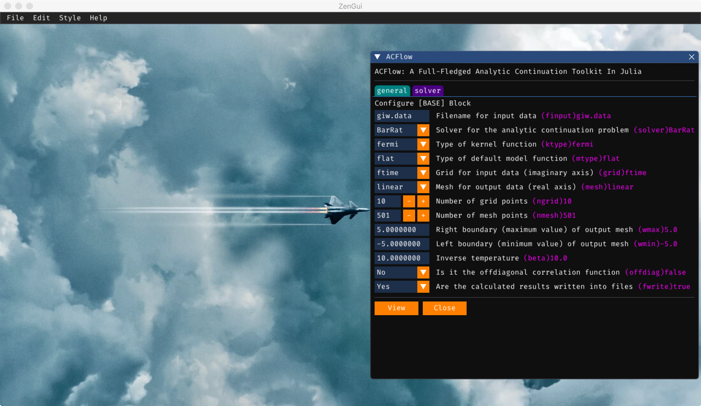
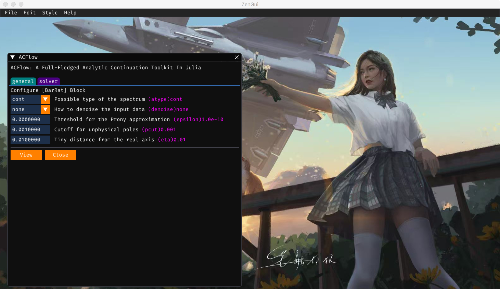

## ACGui

[ACGui](https://github.com/huangli712/ACGui) is a web-based graphic user interface for ACFlow. Now it supports the `MaxEnt`, `BarRat`, `NevanAC`, `StochAC`, `StochSK`, `StochOM` and `StochPX` solvers (in other words, all solvers implemented in the ACFlow package are supported). The users can use ACGui to generate configuration parameters, perform analytic continuation calculations, and visualize calculated results.

## ZenGui

[ZenGui](https://github.com/huangli712/ZenGui) provides another graphic user interface for ACFlow. It is based on the `Dear ImGui` C++ library and its Julia language wrapper `CImGui.jl`. ZenGui is much more effective than ACGui. More important, ZenGui supports the other many-body tools, such as ACTest, Dyson, DFermion, iQIST, and Zen, as well.

**Figure 1 |** The `ACFlow` window 1 in the ZenGui app. We should setup the [[BASE] Block](@ref base_block) here.

**Figure 2 |** The `ACFlow` window 2 in the ZenGui app. We should setup the analytic continuation solver selected here.

!!! note

    The ZenGui app can be used to generate essential configuration files only.
