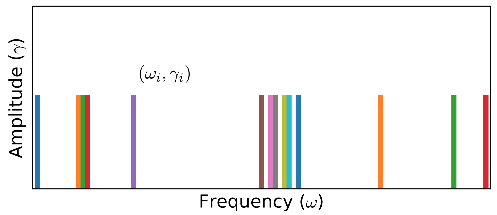

!!! info

    In principle, for given Green's function ``G``, there exists infinitely many spectral densities ``A(\omega)`` that can be used to reproduce ``G`` via ``\mathbf{G} = \mathbf{KA}``. The maximum entropy method tries to pick up the most likely spectral function which maximizes ``P[A|\bar{G}]`` (It actually maximizes ``Q``). Here, we would like to introduce an alternative approach, namely the stochastic analytic continuation. It is argued that the weights for all the possible spectral densities are the same if they can give rise to the same ``\chi^2``. At first, a sequence of spectral densities will be generated by stochastic method. Then an unbiased thermal average of all possible spectra, Boltzmann weighted according to goodness-of-fit function ``\chi^{2}``, produces an average spectrum. Thus sometimes the method was named as average spectrum method or stochastic sampling method in the references. There are several variants for the stochastic analytic continuation. Next we will introduce two representative algorithms as proposed by A. W. Sandvik and K. S. D. Beach, respectively.

## [Sandvik's Algorithm](@id san)

It was early on realized that a different way to achieve a smooth spectrum is to average over many solutions with reasonable ``\chi^2`` values. Several years later, A. W. Sandvik introduced the stochastic analytic continuation in a slightly different form. He suggested that the spectral function ``A(\omega)`` can be parameterized using ``N`` ``\delta`` functions (Please see Fig.1 for schematic diagram):
```math
A(\omega) = \sum^{N}_{i = 1} \gamma_i \delta(\omega - \omega_i),
```
where ``\gamma_i`` and ``\omega_i`` denote the amplitude and position of the ``i``-th ``\delta`` function, respectively. Next, the Metropolis important sampling algorithm is employed to sample the configuration space ``\mathcal{C} = \{\omega_i, \gamma_i\}``. In practice, there are two elementary Monte Carlo updates. One is to change the amplitudes of a pair of ``\delta`` functions under the constraint ``\sum_i \gamma_i = 1``. Another one is to shift position of a randomly chosen ``\delta`` function. Of course, block or global updates can be implemented to improve ergodicity and sampling efficiency.



**Figure 1 |** Typical Monte Carlo field configurations for stochastic analytic continuation (A. W. Sandvik's version). Here, the ``\delta`` functions reside at unrestricted frequencies ``\{\omega_i\}``, but their amplitudes ``\{\gamma_i\}`` are equal and fixed. Note that different parameterizations are also possible.

The transition probability of Monte Carlo updates reads:
```math
p(\mathcal{C} \to \mathcal{C}') = \exp\left(-\frac{\Delta\chi^2}{2\Theta}\right),
```
where ``\chi^2`` is the goodness-of-fit function, ``\Theta`` is a regulation parameter which is similar to the ``\alpha`` parameter appeared in the maximum entropy method. Well, the remaining problem is how to fix ``\Theta``. Sandvik suggested to measure the following entropic term for some ``\Theta``:
```math
S(\Theta) = - \sum^{N}_{i = 1} \gamma_i \log(\gamma_i) K(0,\omega_i),
```
where ``K`` is the kernel function as defined above. Then make a plot of ``S`` with respect to ``\log(\Theta^{-1})``. Overall, when ``\Theta`` is large, ``S`` exhibits large fluctuations. When ``\Theta`` is small, ``S`` will approach its global minimum steadily. A sharp drop in ``S`` before the approach to a constant value has been observed, and there is a local maximum at some ``\Theta = \hat{\Theta}`` preceding the drop. Thus, Sandvik postulated that ``\hat{\Theta}`` was the optimum value at which to accumulate and average the spectral function. Syljuasen *et al.* suggested that let ``\Theta = 1``. Fuchs *et al.* tried to fix ``\Theta`` by using Bayesian inference. Such that their approach was named as stochastic analytic inference. Very recently, Shao and Sandvik *et al.* proposed a smart method to determine the optimal value of ``\Theta``. ``\Theta`` is adjusted so that
```math
\langle \chi^2(\Theta) \rangle \approx \chi^{2}_{\text{min}} + c \sqrt{2\chi^2_{\text{min}}},
```
where ``c`` is a constant of order 1, ``\chi^{2}_{\text{min}}`` is the minimum value of ``\chi^{2}`` at given ``\Theta``. Note that ``\chi^{2}_{\text{min}}`` can be obtained in a simulated annealing process to very low ``\Theta``.

## Relevant Parameters

See [[StochSK] Block](@ref stochsk_block)

## References

**[1]** A. W. Sandvik, Stochastic method for analytic continuation of quantum Monte Carlo data, *Phys. Rev. B* **57**, 10287 (1998)

**[2]** A. W. Sandvik, Constrained sampling method for analytic continuation, *Phys. Rev. E* **94**, 063308 (2016).

**[3]** H. Shao, Y. Q. Qin, S. Capponi, S. Chesi, Z. Y. Meng, A. W. Sandvik, Nearly Deconfined Spinon Excitations in the Square-Lattice Spin-1/2 Heisenberg Antiferromagnet, *Phys. Rev. X* **7**, 041072 (2017).

**[4]** H. Shao, A. W. Sandvik, Progress on stochastic analytic continuation of quantum Monte Carlo data, *Phys. Rep.* **1003**, 1 (2023).
