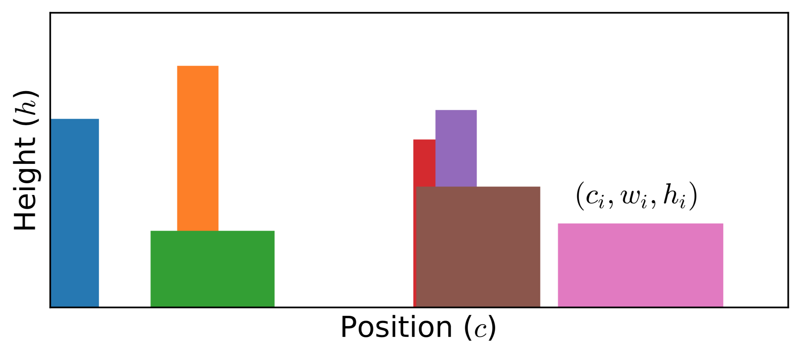

A. O. Mishchenko *et al.* proposed the stochastic optimization method. Though it looks like the stochastic analytic continuation, their differences are quite apparent. The stochastic optimization method does not need any likelihood function or Boltzmann distribution to weight the candidate spectral functions. It generates a lot of spectral functions through Monte Carlo samplings. For each candidate spectral function, the deviation ``D`` between the reconstructed Green's function ``\tilde{G}`` and original Green's function ``\bar{G}`` is measured. Those spectral functions with small deviations ``D`` are selected and averaged. Such that the desired spectral function is obtained.

## [Deviation Function](@id som)

In the stochastic optimization method, the deviation between reconstructed data ``\tilde{G}`` and input data ``\bar{G}`` is described by:
```math
D[A] = \sum^{M}_{m=1} |\Delta(m)|,
```
where ``M`` is the number of input data, and ``\Delta(m)`` is the deviation function,
```math
\Delta(m) = \frac{\bar{G}(m) - \tilde{G}(m)}{S(m)}.
```
Here, ``S(m) = |G(m)|^{d}`` (where ``0 \le d \le 1``). Recently, Krivenko *et al.* suggested that it would be better to use the goodness-of-fit functional ``\chi^2[A]`` to replace ``D[A]``.

## Spectral Density

The stochastic optimization method will try to accumulate the candidate spectral functions that manifest small ``D[A]``. Supposed the Monte Carlo simulations are repeated for ``L`` times. For the ``i``-th Monte Carlo simulation, the spectral density ``A_i(\omega)`` and deviation ``D[A_i]`` are recorded. The minimum value of deviation is ``\min\{D[A_i]\}``. Thus, the final spectral density reads:
```math
A(\omega) = \frac{1}{L_{\text{good}}} \sum^{L}_{i = 1}
\theta(\alpha_{\text{good}} \min\{D[A_i]\} - D[A_i]) A_{i}(\omega).
```
Here, ``\theta(x)`` is the Heaviside step function, and ``\alpha_{\text{good}}`` is a adjustable parameter. ``L_{\text{good}}`` denotes the number of `good` spectral functions:
```math
L_{\text{good}} = \sum^{L}_{i = 1}
\theta(\alpha_{\text{good}} \min\{D[A_i]\} - D[A_i]).
```
That is to say, only those spectral functions who satisfy the following condition will be selected:
```math
D[A_i] \le \alpha_{\text{good}} \min\{D[A_i]\}.
```
Clearly, the larger ``\alpha_{\text{good}}`` is, the more spectral functions are included. It is usually set to 2.

## Rectangle Representation

Similar to the stochastic analytic continuation, the stochastic optimization method usually employs a few rectangle functions to parameterize the spectral function:
```math
A(\omega) = \sum_i R_{\{c_i, w_i, h_i\}} (\omega),
```
where ``i`` is the index of rectangle function. The definition of rectangle function ``R_{\{c_i, w_i, h_i\}} (\omega)`` reads:
```math
R_{\{c_i, w_i, h_i\}} (\omega) =
h_i
\theta[\omega - (c_i - w_i/2)]
\theta[(c_i + w_i/2) - \omega],
```
where ``c_i``, ``w_i``, ``h_i`` denote the center, width, and height of the ``i``-th rectangle, respectively. Pay attention to that the area of all rectangles must be normalized to 1:
```math
\sum_i h_i w_i = 1.
```



**Figure 1 |** Typical Monte Carlo field configurations for stochastic optimization method. The spectral function is parameterized by multiple rectangle functions. Here, ``c_i``, ``w_i``, and ``h_i`` denote the center, width, and height of the ``i``-th rectangle, respectively.

## Monte Carlo Sampling

The parameters of all rectangle functions create a configuration space:
```math
\mathcal{C} = \{c_i, w_i, h_i\}.
```
Then the Metropolis algorithm is utilized to sample this configuration space. Mishchenko *et al.* introduces seven Monte Carlo updates, including: (a) Insert a new rectangle, change width and height of another rectangle; (b) Remove an existing rectangle, change width and height of another rectangle; (c) Shift position of any rectangles; (d) Change widths of any two rectangles; (e) Change heights of any two rectangles; (f) Split a rectangle into two new rectangles; (g) Merge two adjacent rectangles into a new rectangle. The transition probability of these Monte Carlo updates is:
```math
p(\mathcal{C} \to \mathcal{C}') = \left(\frac{D[A_{\mathcal{C}}]}{D[A_{\mathcal{C}'}]}\right)^{1+d}.
```

As compared to the maximum entropy method, the likelihood function, entropic term, and model function are absent in the stochastic optimization method. As compared to the stochastic analytic continuation, there are no adjustable parameters, such as ``\Theta`` in Sandvik's algorithm and ``\alpha`` in Beach's algorithm. Thus, the simulated results of the stochastic optimization method are less affected by artificial parameters.

## Relevant Parameters

See [[StochOM] Block](@ref stochom_block)

## References

[1] A. S. Mishchenko, N. V. Prokof’ev, A. Sakamoto, B. V. Svistunov, Diagrammatic quantum Monte Carlo study of the frohlich polaron, *Phys. Rev. B* **62**, 6317 (2000).

[2] I. Krivenko, M. Harland, TRIQS/SOM: Implementation of the stochastic optimization method for analytic continuation, *Comput. Phys. Commun.* **239**, 166 (2019).

[3] I. Krivenko, A. S. Mishchenko, TRIQS/SOM 2.0: Implementation of the stochastic optimization with consistent constraints for analytic continuation, *Comput. Phys. Commun.* **280**, 108491 (2022).
