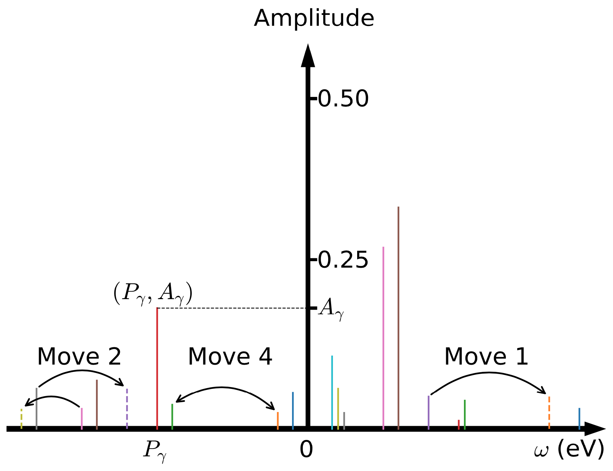

!!! warning

    The StochPX solver is experimental. Please use it at your own risk.

## Pole Representation

Please read the [preliminary knowledge](@ref pole_repr).

## [Stochastic Optimization](@id spx)

Supposed that the input Matsubara Green's function is ``\mathcal{G}(i\omega_n)``, where ``n =`` 1, 2, ``\cdots``, ``N_{\omega}``, the objective of analytic continuation is to fit the (possibly noisy and incomplete) Matsubara data into the pole representation under some constraints. In mathematical language, we should solve the following multivariate optimization problem:
```math
\mathop{\arg\min}\limits_{ \left\{A_{\gamma}, P_{\gamma}\right\}^{N_p}_{\gamma = 1} } \chi^{2}\left[\left\{A_{\gamma}, P_{\gamma}\right\}^{N_p}_{\gamma = 1}\right].
```
Here, ``\chi^{2}\left[\left\{A_{\gamma}, P_{\gamma}\right\}^{N_p}_{\gamma = 1}\right]`` is the so-called goodness-of-fit function or loss function. Its definition is as follows:
```math
\chi^{2}
\left[\left\{A_{\gamma}, P_{\gamma}\right\}^{N_p}_{\gamma = 1}\right]
= \frac{1}{N_{\omega}}\sum^{N_{\omega}}_{n = 1}
\left|\left|
\mathcal{G}(i\omega_n) - \sum^{N_p}_{\gamma = 1} \frac{A_{\gamma}}{i\omega_n - P_{\gamma}}
\right|\right|^2_{F},
```
where ``||\cdot||_{F}`` denotes the Frobenius norm. The minimization of ``\chi^2`` is highly non-convex. Traditional gradient-based optimization methods, such as non-negative least squares method, conjugate gradient method, Newton and quasi-Newton methods, are frequently trapped in local minima. Their optimized results strongly depend on the initial guess. The semi-definite relaxation (SDR) fitting method, adaptive Antoulas-Anderson (AAA) algorithm, and conformal mapping plus Prony's method, which have been employed to search the locations of poles in previous works, are also tested. But these methods usually fail when ``N_p`` is huge [``N_p \sim O(10^3)``] or the Matsubara data are noisy.

In order to overcome the above obstacles, we employ the simulated annealing method to locate the global minimum of ``\chi^{2}``. The core idea is as follows: First of all, a set of ``\{A_{\gamma}, P_{\gamma}\}`` parameters are generated randomly. These parameters form a configuration space ``\mathcal{C} = \{A_{\gamma}, P_{\gamma}\}``. Second, this configuration space is sampled by using the Metropolis Monte Carlo algorithm. In the present SPX method, four Monte Carlo updates are supported (see Figure 1). They include: (i) Select one pole randomly and shift its location. (ii) Select two poles randomly and shift their locations. (iii) Select two poles randomly and change their amplitudes. The sum-rules for fermionic and bosonic correlatores, should be respected in this update. (iv) Select two poles randomly and exchange their amplitudes. Assumed that the current Monte Carlo configuration is ``\mathcal{C} = \{A_{\gamma}, P_{\gamma}\}``, the new one is ``\mathcal{C}' = \{A'_{\gamma}, P'_{\gamma}\}``, and ``\Delta \chi^2 = \chi^2(\mathcal{C}') - \chi^2(\mathcal{C})``, then the transition probability reads:
```math
p(\mathcal{C} \to \mathcal{C}') =
\left\{
    \begin{array}{lr}
        \exp\left(-\frac{\Delta \chi^2}{2\Theta}\right), & \text{if}~\Delta \chi^2 > 0, \\
        1.0, & \text{if}~\Delta \chi^2 \le 0,
    \end{array}
\right.
```
where ``\Theta`` is an artificial system temperature and ``\chi^2`` is interpreted as energy of the system. Third, the above two steps should be restarted periodically to avoid trapped by local minima. Fourth, once all the Monte Carlo sampling tasks are finished, we should pick up the *best*  solution which exhibits the smallest ``\chi^2``, or select some *good* solutions with small ``\chi^2`` and evaluate their arithmetic average. Finally, with the optimized ``N_{p}``, and ``A_{\gamma}``, and ``P_{\gamma}`` parameters, the retarded Green's function ``G^{R}(\omega)`` can be easily evaluated by replacing ``i\omega_n`` with ``\omega + i\eta`` in the pole representation, where ``\eta`` is a positive infinitesimal number. And the spectral density ``A(\omega)`` is calculated by:
```math
A(\omega) = - \frac{1}{\pi} \text{Im} G^{R}(\omega).
```



**Figure 1 |** Schematic picture for the pole representation of the Matsubara Green's function. The poles are visualized by vertical colorful bars. `Move 1`, `Move 2`, and `Move 4` denote three possible Monte Carlo updates: (i) shift a randomly selected pole, (ii) shift two randomly selected poles, and (iii)~swap two randomly selected poles. See main text for more details.

## [Constrained Sampling Algorithm](@id stochpx_csa)

In the SPX method, the amplitudes and locations of the poles should be optimized by the Monte Carlo algorithm under some constraints (i.e., the sum-rules). We note that these constraints are from the canonical relations for the fermionic and bosonic operators. They should be satisfied, or else the causality of the spectrum is not guaranteed. But beyond that, more constraints are allowable. Further restrictions on the amplitudes and locations of the poles can greatly reduce the configuration space that need to be sampled and enhance the possibility to reach the global minimum of the optimization problem. The possible strategies include: (1) Restrict ``\{A_{\gamma}\}`` only; (2) Restrict ``\{P_{\gamma}\}`` only; and (3) Restrict ``\{A_{\gamma}\}`` and ``\{P_{\gamma}\}`` at the same time. These extra constraints can be deduced from *a priori* knowledge about the Matsubara Green's function ``G(i\omega_n)`` and the spectral density ``A(\omega)``. For example, for a molecule system, the amplitudes of the poles are likely close. On the other hand, if we know nothing about the input data, we can always try some constraints. The universal trend is that the more reasonable the constraints, the smaller the ``\chi^2`` function. This is the so-called `constrained sampling algorithm`. By combined it with the SPX method (dubbed `C-SPX`), the ability of resolving fine features in the spectra will be greatly enhanced. To the best of our knowledge, the constrained sampling algorithm was firstly proposed by A. W. Sandvik. And then it is broadly used in the analytic continuations of spin susceptibilities of quantum many-body systems. Quite recently, Shao and Sandvik summarized various approaches to apply the constraints and benchmark their performances in a comprehensive review concerning the SAC method. Due to the similarities of the SPX and SAC methods, it is believed that all the constraint schemes as suggested in previous works should be useful for the SPX method.

## [Self-Adaptive Sampling Algorithm](@id stochpx_ssa)

In analogy to the SAC method, the poles in the SPX method are distributed randomly in a real frequency grid. This grid must be extremely dense, and is usually linear. But in principle a nonuniform grid is possible. For example, Shao and Sandvik have suggested a nonlinear grid with monotonically increasing spacing for the ``\delta`` functions which are used to parameterize a spectrum that exhibits a sharp band edge. Since a spectral density can be viewed as a probability distribution and we notice that the distribution of the poles looks quite similar to the spectrum. So, it is natural to adjust the frequency grid dynamically to make sure that the grid density has approximate distribution with the spectral density as obtained in previous run. We adopt the following algorithm to update the frequency grid: (1) Create a new function ``\phi(\epsilon)``:
```math
\phi(\epsilon) = \int^{\epsilon}_{\omega_{\text{min}}} A(\omega) d\omega,~\epsilon \in [\omega_{\text{min}},\omega_{\text{max}}].
```
(2) The new frequency grid ``f_i`` is evaluated by:
```math
f_i = \phi^{-1}(\lambda_i),~i = 1, \cdots, N_f,
```
where ``\lambda_i`` is a linear mesh in ``[\phi(\omega_{\text{min}}),\phi(\omega_{\text{max}})]``. Next we should perform the analytic continuation simulation again and extract a new spectrum. We find that the ``\chi^2`` drops quickly in the first a few iterations, and then approaches to a constant value slowly. At the same time, the spectrum is refined gradually. In the iterations, the frequency grid for the poles is adaptively modified according to the given spectrum, thus we call it the `self-adaptive sampling algorithm`. It is actually a new variation of the constrained sampling algorithm. More important, it is quite effective. Based on our experiences, ``3 \sim 5`` iterations are enough to obtain a convergent solution. In practice, we often use the spectrum generated by the MaxEnt method to initialize the frequency grid, and then employ the SPX method (dubbed `SA-SPX`) to refine this spectrum further.

## Relevant Parameters

See [[StochPX] Block](@ref stochpx_block)

## References

**[1]** Li Huang, Shuang Liang, Stochastic pole expansion method for analytic continuation of the Green's function, *Phys. Rev. B* **108**, 235143 (2023).

**[2]** Li Huang, Shuang Liang, Reconstructing lattice QCD spectral functions with stochastic pole expansion and Nevanlinna analytic continuation, *Phys. Rev. D* **109**, 054508 (2024).
